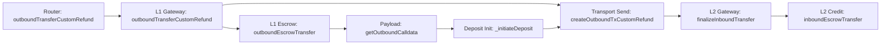

# Deposit Review

## Flow



`Inbox / Retryable delivery` is shown here only as the transport segment of the full deposit path. Nitro message-delivery internals are outside my current review scope.

## 1. L1GatewayRouter.outboundTransferCustomRefund(...)

```solidity
function outboundTransferCustomRefund(
    address _token,
    address _refundTo,
    address _to,
    uint256 _amount,
    uint256 _maxGas,
    uint256 _gasPriceBid,
    bytes calldata _data
) public payable override returns (bytes memory) {
    address gateway = getGateway(_token);
    bytes memory gatewayData = GatewayMessageHandler.encodeFromRouterToGateway(
        msg.sender,
        _data
    );

    emit TransferRouted(_token, msg.sender, _to, gateway);
    return
        IL1ArbitrumGateway(gateway).outboundTransferCustomRefund{ value: msg.value }(
            _token,
            _refundTo,
            _to,
            _amount,
            _maxGas,
            _gasPriceBid,
            gatewayData
        );
}
```

What it does:

- selects the gateway for `_token`
- preserves router-origin semantics
- forwards the deposit into the corresponding L1 gateway

Invariants:

- the router-level deposit path must route through the gateway selected by the routing surface
- router-origin semantics must be preserved when forwarding into the gateway layer

## 2. L1ArbitrumGateway.outboundTransferCustomRefund(...)

```solidity
function outboundTransferCustomRefund(
    address _l1Token,
    address _refundTo,
    address _to,
    uint256 _amount,
    uint256 _maxGas,
    uint256 _gasPriceBid,
    bytes calldata _data
) public payable virtual override returns (bytes memory res) {
    require(isRouter(msg.sender), "NOT_FROM_ROUTER");
    address _from;
    uint256 seqNum;
    bytes memory extraData;
    {
        uint256 _maxSubmissionCost;
        uint256 tokenTotalFeeAmount;
        if (super.isRouter(msg.sender)) {
            (_from, extraData) = GatewayMessageHandler.parseFromRouterToGateway(_data);
        } else {
            _from = msg.sender;
            extraData = _data;
        }
        (_maxSubmissionCost, extraData, tokenTotalFeeAmount) = _parseUserEncodedData(extraData);

        require(extraData.length == 0, "EXTRA_DATA_DISABLED");

        require(_l1Token.isContract(), "L1_NOT_CONTRACT");
        address l2Token = calculateL2TokenAddress(_l1Token);
        require(l2Token != address(0), "NO_L2_TOKEN_SET");

        _amount = outboundEscrowTransfer(_l1Token, _from, _amount);

        res = getOutboundCalldata(_l1Token, _from, _to, _amount, extraData);

        seqNum = _initiateDeposit(
            _refundTo,
            _from,
            _amount,
            _maxGas,
            _gasPriceBid,
            _maxSubmissionCost,
            tokenTotalFeeAmount,
            res
        );
    }
    emit DepositInitiated(_l1Token, _from, _to, seqNum, _amount);
    return abi.encode(seqNum);
}
```

What it does:

- accepts a routed deposit
- resolves the effective `_from`
- parses user-encoded data
- validates the L1 token and the configured L2 representation
- performs escrow
- builds the outbound payload
- initiates the L1 -> L2 deposit message

Invariants:

- the gateway-level deposit path must only be callable through the router
- source-side accounting must complete before payload construction and deposit initiation
- the deposit path must not be built on an invalid L1 token or without a configured L2 representation
- the function must return the current deposit sequence number

## 3. L1ArbitrumGateway.outboundEscrowTransfer(...)

```solidity
function outboundEscrowTransfer(
    address _l1Token,
    address _from,
    uint256 _amount
) internal virtual returns (uint256 amountReceived) {
    uint256 prevBalance = IERC20(_l1Token).balanceOf(address(this));
    IERC20(_l1Token).safeTransferFrom(_from, address(this), _amount);
    uint256 postBalance = IERC20(_l1Token).balanceOf(address(this));
    return postBalance - prevBalance;
}
```

What it does:

- transfers the L1 token into gateway escrow
- computes the amount actually received

Invariants:

- source-side accounting must pull the asset from `_from` into the gateway contract
- the downstream flow must use the actually received amount, not a blind nominal `_amount`

## 4. L1ArbitrumGateway.getOutboundCalldata(...)

```solidity
function getOutboundCalldata(
    address _l1Token,
    address _from,
    address _to,
    uint256 _amount,
    bytes memory _data
) public view virtual override returns (bytes memory outboundCalldata) {
    bytes memory emptyBytes = "";

    outboundCalldata = abi.encodeWithSelector(
        ITokenGateway.finalizeInboundTransfer.selector,
        _l1Token,
        _from,
        _to,
        _amount,
        GatewayMessageHandler.encodeToL2GatewayMsg(emptyBytes, _data)
    );

    return outboundCalldata;
}
```

What it does:

- builds the payload for the destination-side L2 finalize step
- preserves `_l1Token / _from / _to / _amount` semantics

Invariants:

- the outbound payload must target `finalizeInboundTransfer`
- the payload must preserve the deposit token, sender, recipient, and amount

## 5. L1ArbitrumGateway._initiateDeposit(...)

```solidity
function _initiateDeposit(
    address _refundTo,
    address _from,
    uint256 _amount,
    uint256 _maxGas,
    uint256 _gasPriceBid,
    uint256 _maxSubmissionCost,
    uint256,
    bytes memory _data
) internal virtual returns (uint256) {
    return
        createOutboundTxCustomRefund(
            _refundTo,
            _from,
            _amount,
            _maxGas,
            _gasPriceBid,
            _maxSubmissionCost,
            _data
        );
}
```

What it does:

- forwards already prepared deposit semantics into the transport-facing creation step

Invariants:

- the transport-facing deposit creation step must use the already built outbound calldata without changing its meaning

## 6. L1ArbitrumGateway.createOutboundTxCustomRefund(...)

```solidity
function createOutboundTxCustomRefund(
    address _refundTo,
    address _from,
    uint256,
    uint256 _maxGas,
    uint256 _gasPriceBid,
    uint256 _maxSubmissionCost,
    bytes memory _outboundCalldata
) internal virtual returns (uint256) {
    return
        sendTxToL2CustomRefund(
            inbox,
            counterpartGateway,
            _refundTo,
            _from,
            msg.value,
            0,
            L2GasParams({
                _maxSubmissionCost: _maxSubmissionCost,
                _maxGas: _maxGas,
                _gasPriceBid: _gasPriceBid
            }),
            _outboundCalldata
        );
}
```

What it does:

- translates the prepared deposit payload into retryable creation on the transport layer
- forwards `msg.value` as inbox-path funding
- targets `counterpartGateway`

Invariants:

- the transport-facing deposit path must target `counterpartGateway`
- callvalue semantics must remain consistent between the gateway layer and the inbox funding layer

## 7. L2ArbitrumGateway.finalizeInboundTransfer(...)

```solidity
function finalizeInboundTransfer(
    address _token,
    address _from,
    address _to,
    uint256 _amount,
    bytes calldata _data
) external payable override onlyCounterpartGateway {
    (bytes memory gatewayData, bytes memory callHookData) = GatewayMessageHandler
        .parseFromL1GatewayMsg(_data);

    if (callHookData.length != 0) {
        callHookData = bytes("");
    }

    address expectedAddress = calculateL2TokenAddress(_token);

    if (!expectedAddress.isContract()) {
        bool shouldHalt = handleNoContract(
            _token,
            expectedAddress,
            _from,
            _to,
            _amount,
            gatewayData
        );
        if (shouldHalt) return;
    }

    bool shouldWithdraw = !_isValidTokenAddress(_token, expectedAddress);
    if (shouldWithdraw) {
        triggerWithdrawal(_token, address(this), _from, _amount, "");
        return;
    }

    inboundEscrowTransfer(expectedAddress, _to, _amount);
    emit DepositFinalized(_token, _from, _to, _amount);

    return;
}
```

What it does:

- accepts the counterpart-gated L1 -> L2 finalize call
- parses the payload
- resolves the expected L2 token
- handles the no-contract branch
- handles the invalid-mapping fallback branch
- executes the final L2 credit on the normal branch

Invariants:

- the destination-side finalize path must remain counterpart-gated
- the missing-contract branch must not silently continue the normal mint path
- invalid L1/L2 token correspondence must not end in the normal credit branch
- final L2 credit must happen only on the validated expected token path

## 8. L2ArbitrumGateway.inboundEscrowTransfer(...)

```solidity
function inboundEscrowTransfer(
    address _l2Address,
    address _dest,
    uint256 _amount
) internal virtual {
    IArbToken(_l2Address).bridgeMint(_dest, _amount);
}
```

What it does:

- performs the final L2 credit by minting the corresponding L2 token

Invariants:

- the final L2 credit must use the validated expected token address
- the final credit must go to `_dest` for `_amount`
