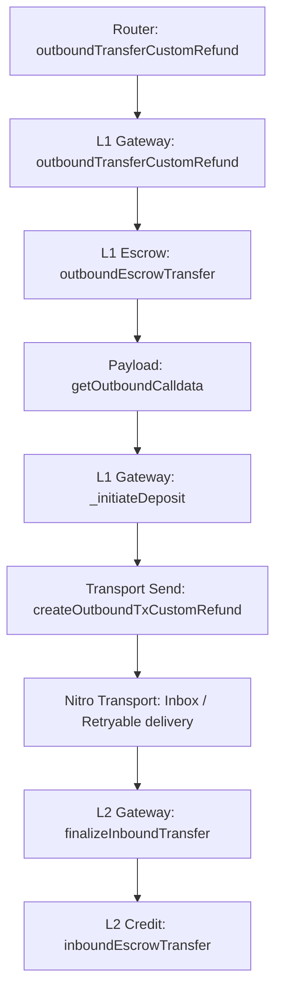

# Deposit Review

## Flow

`Inbox / Retryable delivery` is shown here only as the transport segment of the full deposit path. Nitro message-delivery internals are outside my current review scope.

## 1. L1GatewayRouter.outboundTransferCustomRefund(...)

What it does:

- selects the gateway for `_token`
- preserves router-origin semantics
- forwards the deposit into the corresponding L1 gateway

Invariants:

- the router-level deposit path must route through the gateway selected by the routing surface
- router-origin semantics must be preserved when forwarding into the gateway layer

## 2. L1ArbitrumGateway.outboundTransferCustomRefund(...)

What it does:

- accepts a routed deposit
- resolves the effective `_from`
- parses user-encoded data
- validates the L1 token and the configured L2 representation
- performs escrow
- builds the outbound payload
- initiates the L1 -> L2 deposit message

Invariants:

- the gateway-level deposit path must only be callable through the router
- source-side accounting must complete before payload construction and deposit initiation
- the deposit path must not be built on an invalid L1 token or without a configured L2 representation
- the function must return the current deposit sequence number

## 3. L1ArbitrumGateway.outboundEscrowTransfer(...)

What it does:

- transfers the L1 token into gateway escrow
- computes the amount actually received

Invariants:

- source-side accounting must pull the asset from `_from` into the gateway contract
- the downstream flow must use the actually received amount, not a blind nominal `_amount`

## 4. L1ArbitrumGateway.getOutboundCalldata(...)

What it does:

- builds the payload for the destination-side L2 finalize step
- preserves `_l1Token / _from / _to / _amount` semantics

Invariants:

- the outbound payload must target `finalizeInboundTransfer`
- the payload must preserve business-level deposit semantics without silent rewrite

## 5. L1ArbitrumGateway._initiateDeposit(...)

What it does:

- forwards already prepared deposit semantics into the transport-facing creation step

Invariants:

- the transport-facing deposit creation step must use the already built outbound calldata without semantic rewrite

## 6. L1ArbitrumGateway.createOutboundTxCustomRefund(...)

What it does:

- translates the prepared deposit payload into retryable creation on the transport layer
- forwards `msg.value` as inbox-path funding
- targets `counterpartGateway`

Invariants:

- the transport-facing deposit path must target `counterpartGateway`
- callvalue semantics must remain deterministic between the gateway layer and the inbox funding layer

## 7. L2ArbitrumGateway.finalizeInboundTransfer(...)

What it does:

- accepts the counterpart-gated L1 -> L2 finalize call
- parses the payload
- resolves the expected L2 token
- handles the no-contract branch
- handles the invalid-mapping fallback branch
- executes the final L2 credit on the normal branch

Invariants:

- the destination-side finalize path must remain counterpart-gated
- the missing-contract branch must not silently continue the normal mint path
- invalid L1/L2 token correspondence must not end in the normal credit branch
- final L2 credit must happen only on the validated expected token path

## 8. L2ArbitrumGateway.inboundEscrowTransfer(...)

What it does:

- performs the final L2 credit by minting the corresponding L2 token

Invariants:

- the final L2 credit must use the validated expected token address
- the final credit must go to `_dest` for `_amount`
