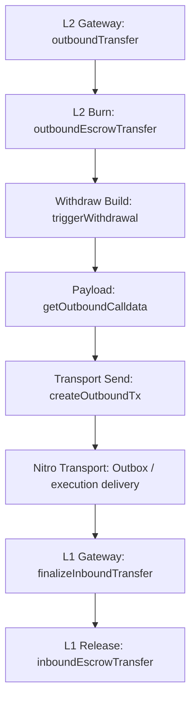

# Withdraw Review

## Flow

`Outbox / execution delivery` is shown here only as the transport segment of the full withdraw path. Nitro execution internals are outside my current review scope.

## 1. L2ArbitrumGateway.outboundTransfer(...)

What it does:

- starts the L2 -> L1 withdraw path
- resolves the effective `_from`
- validates the expected L1/L2 token pair
- executes the burn step
- initiates the L2 -> L1 withdrawal message

Invariants:

- the normal withdraw path must not accept `msg.value`
- the router path and the direct path must deterministically resolve `_from` and `_extraData`
- withdraw must run only through the correct deployed L2 representation of the expected L1 token
- source-side accounting must complete before withdrawal-message creation

## 2. L2ArbitrumGateway.outboundEscrowTransfer(...)

What it does:

- performs the source-side burn of the L2 representation

Invariants:

- withdraw accounting on L2 must happen through burning the corresponding L2 token
- the downstream flow must carry the burnt amount

## 3. L2ArbitrumGateway.triggerWithdrawal(...)

What it does:

- connects payload construction with transport-side tx creation
- emits `WithdrawalInitiated`

Invariants:

- the current withdrawal must receive its `id` from the transport-side creation path
- the current `currExitNum` must correspond to the current initiated withdrawal

## 4. L2ArbitrumGateway.getOutboundCalldata(...)

What it does:

- builds the payload for future L1 finalize
- includes `token/sender/recipient/amount` semantics and the current `exitNum`

Invariants:

- the outbound payload must target `finalizeInboundTransfer`
- the payload must preserve `_token / _from / _to / _amount` semantics without silent rewrite
- the current `exitNum` must be included in the payload before the later transport-side increment

## 5. L2ArbitrumGateway.createOutboundTx(...)

What it does:

- increments `exitNum` after inclusion into the current payload
- sends the L2 -> L1 message to `counterpartGateway`

Invariants:

- `exitNum` must not be incremented before inclusion into the current payload
- the transport-facing withdraw path must target `counterpartGateway`
- the default withdraw message must not carry L1 callvalue

## 6. L1ArbitrumGateway.finalizeInboundTransfer(...)

What it does:

- accepts the counterpart-gated L2 -> L1 finalize call
- parses the withdrawal payload
- resolves the final recipient
- performs the final L1 release

Invariants:

- the L1 finalize path must only be callable by `counterpartGateway`
- the final L1 release must use the post-resolution `_to`

## 7. L1ArbitrumGateway.inboundEscrowTransfer(...)

What it does:

- performs the final L1 release of the escrowed token to the recipient

Invariants:

- the final release must use the validated `_l1Token`
- the final release must go to the resolved `_dest` for `_amount`
