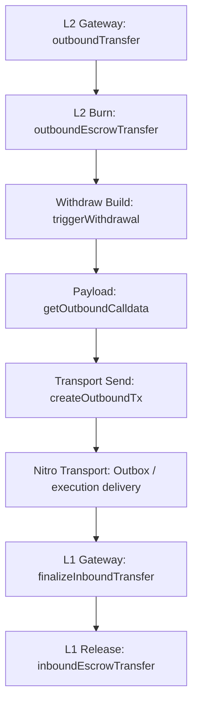

# Withdraw Review

## Flow



`Outbox / execution delivery` is shown here only as the transport segment of the full withdraw path. Nitro execution internals are outside my current review scope.

## 1. L2ArbitrumGateway.outboundTransfer(...)

```solidity
function outboundTransfer(
    address _l1Token,
    address _to,
    uint256 _amount,
    uint256,
    uint256,
    bytes calldata _data
) public payable virtual override returns (bytes memory res) {
    require(msg.value == 0, "NO_VALUE");

    address _from;
    bytes memory _extraData;
    {
        if (isRouter(msg.sender)) {
            (_from, _extraData) = GatewayMessageHandler.parseFromRouterToGateway(_data);
        } else {
            _from = msg.sender;
            _extraData = _data;
        }
    }
    require(_extraData.length == 0, "EXTRA_DATA_DISABLED");

    uint256 id;
    {
        address l2Token = calculateL2TokenAddress(_l1Token);
        require(l2Token.isContract(), "TOKEN_NOT_DEPLOYED");
        require(_isValidTokenAddress(_l1Token, l2Token), "NOT_EXPECTED_L1_TOKEN");

        _amount = outboundEscrowTransfer(l2Token, _from, _amount);
        id = triggerWithdrawal(_l1Token, _from, _to, _amount, _extraData);
    }
    return abi.encode(id);
}
```

What it does:

- starts the L2 -> L1 withdraw path
- resolves the effective `_from`
- validates the expected L1/L2 token pair
- executes the burn step
- initiates the L2 -> L1 withdrawal message

Invariants:

- the normal withdraw path must not accept `msg.value`
- the router path and the direct path must deterministically resolve `_from` and `_extraData`
- withdraw must run only through the correct deployed L2 representation of the expected L1 token
- source-side accounting must complete before withdrawal-message creation

## 2. L2ArbitrumGateway.outboundEscrowTransfer(...)

```solidity
function outboundEscrowTransfer(
    address _l2Token,
    address _from,
    uint256 _amount
) internal virtual returns (uint256 amountBurnt) {
    IArbToken(_l2Token).bridgeBurn(_from, _amount);
    return _amount;
}
```

What it does:

- performs the source-side burn of the L2 representation

Invariants:

- withdraw accounting on L2 must happen through burning the corresponding L2 token
- the downstream flow must carry the burnt amount

## 3. L2ArbitrumGateway.triggerWithdrawal(...)

```solidity
function triggerWithdrawal(
    address _l1Token,
    address _from,
    address _to,
    uint256 _amount,
    bytes memory _data
) internal returns (uint256) {
    uint256 currExitNum = exitNum;
    uint256 id = createOutboundTx(
        _from,
        _amount,
        getOutboundCalldata(_l1Token, _from, _to, _amount, _data)
    );
    emit WithdrawalInitiated(_l1Token, _from, _to, id, currExitNum, _amount);
    return id;
}
```

What it does:

- connects payload construction with transport-side tx creation
- emits `WithdrawalInitiated`

Invariants:

- the current withdrawal must receive its `id` from the transport-side creation path
- the current `currExitNum` must correspond to the current initiated withdrawal

## 4. L2ArbitrumGateway.getOutboundCalldata(...)

```solidity
function getOutboundCalldata(
    address _token,
    address _from,
    address _to,
    uint256 _amount,
    bytes memory _data
) public view override returns (bytes memory outboundCalldata) {
    outboundCalldata = abi.encodeWithSelector(
        ITokenGateway.finalizeInboundTransfer.selector,
        _token,
        _from,
        _to,
        _amount,
        GatewayMessageHandler.encodeFromL2GatewayMsg(exitNum, _data)
    );

    return outboundCalldata;
}
```

What it does:

- builds the payload for future L1 finalize
- includes `token/sender/recipient/amount` semantics and the current `exitNum`

Invariants:

- the outbound payload must target `finalizeInboundTransfer`
- the payload must preserve the token, sender, recipient, and amount
- the current `exitNum` must be included in the payload before the later transport-side increment

## 5. L2ArbitrumGateway.createOutboundTx(...)

```solidity
function createOutboundTx(
    address _from,
    uint256,
    bytes memory _outboundCalldata
) internal virtual returns (uint256) {
    exitNum++;
    return
        sendTxToL1(
            0,
            _from,
            counterpartGateway,
            _outboundCalldata
        );
}
```

What it does:

- increments `exitNum` after inclusion into the current payload
- sends the L2 -> L1 message to `counterpartGateway`

Invariants:

- `exitNum` must not be incremented before inclusion into the current payload
- the transport-facing withdraw path must target `counterpartGateway`
- the default withdraw message must not carry L1 callvalue

## 6. L1ArbitrumGateway.finalizeInboundTransfer(...)

```solidity
function finalizeInboundTransfer(
    address _token,
    address _from,
    address _to,
    uint256 _amount,
    bytes calldata _data
) public payable virtual override onlyCounterpartGateway {
    (uint256 exitNum, bytes memory callHookData) = GatewayMessageHandler.parseToL1GatewayMsg(
        _data
    );

    if (callHookData.length != 0) {
        callHookData = bytes("");
    }

    (_to, ) = getExternalCall(exitNum, _to, callHookData);
    inboundEscrowTransfer(_token, _to, _amount);

    emit WithdrawalFinalized(_token, _from, _to, exitNum, _amount);
}
```

What it does:

- accepts the counterpart-gated L2 -> L1 finalize call
- parses the withdrawal payload
- resolves the final recipient
- performs the final L1 release

Invariants:

- the L1 finalize path must only be callable by `counterpartGateway`
- the final L1 release must use the post-resolution `_to`

## 7. L1ArbitrumGateway.inboundEscrowTransfer(...)

```solidity
function inboundEscrowTransfer(
    address _l1Token,
    address _dest,
    uint256 _amount
) internal virtual {
    IERC20(_l1Token).safeTransfer(_dest, _amount);
}
```

What it does:

- performs the final L1 release of the escrowed token to the recipient

Invariants:

- the final release must use the validated `_l1Token`
- the final release must go to the resolved `_dest` for `_amount`
